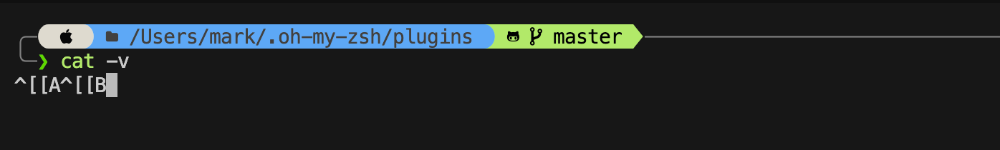

# .Dotfiles Setup 

Manage your dotfiles easily and cleanly using [GNU Stow](https://www.gnu.org/software/stow/).

* * *

## 🚀 Getting Started

1. Clone this repo into your home directory:

```bash
git clone https://github.com/<your-username>/dotfiles.git ~/.dotfiles
```
2. Change into the `.dotfiles` directory:

```bash
cd ~/.dotfiles
```
3. Use Stow to symlink your configs:

```bash
stow .
```

That’s it! 🎉 Your dotfiles are now symlinked into place.

* * *

### Setup and export $HOMEDIR

This is will create the ~/.localvars.sh and include HOMEDIR. Make sure you are in the directory you want to be your $HOMEDIR

```bash
echo "export HOMEDIR=\"$(pwd)\"" >> ~/.localvars.sh
```

* * *

## **🛠 Manual Setup**

If you’re migrating from an existing setup, follow these steps to back up and prepare.

### 1\. Create a Backup Directory

```bash
mkdir ~/backup-pre-dotfiles
```

### 2\. Backup Files and Folders

```bash
cd ~
cp .p10k.zsh .zprofile .zshrc backup-pre-dotfiles
cp -R .oh-my-zsh backup-pre-dotfiles
```

### 3\. Create the `.dotfiles` Directory

```bash
cd ~
mkdir .dotfiles
```

### 4\. Move Files to `.dotfiles`

```bash
mv .p10k.zsh .zprofile .zshrc .dotfiles
```

### 5\. Copy `oh-my-zsh/custom` into `.dotfiles`

```bash
cp -R ~/.oh-my-zsh/custom ~/.dotfiles/.oh-my-zsh
```

### 6\. Rename and Move `~/.oh-my-zsh/custom`

```bash
mv ~/.oh-my-zsh/custom ~/.oh-my-zsh/custom.bak
```

### 7\. Install GNU Stow

```bash
brew install stow
```

### 8\. Apply Dotfiles with Stow

```bash
cd ~/.dotfiles
stow .
```

* * *

## 📂 Folder Structure

After setup, your `.dotfiles` directory should look like this:

```
.dotfiles/
├── .p10k.zsh
├── .zprofile
└── .zshrc
```

_(Files inside `custom/` are just examples — add your own.)_

* * *

## 📌 Common Stow Commands

Here are some useful commands you’ll use often:

- **Stow everything**

```bash
stow .
```
- **Stow a single package (e.g., zsh configs)**

```bash
stow zsh
```
- **Unstow (remove symlinks for a package)**

```bash
stow -D zsh
```
- **Restow (refresh symlinks after changes)**

```bash
stow -R zsh
```
- **Dry-run (see what would happen, without changing files)**

```bash
stow -nv zsh
```

* * *

## <br>

## 🔌 Plugins

Plugin List - [https://github.com/ohmyzsh/ohmyzsh/wiki/Plugins](https://github.com/ohmyzsh/ohmyzsh/wiki/Plugins)

### zsh-autosuggestions

This one has to be installed manually. The github URL is [https://github.com/zsh-users/zsh-autosuggestions](https://github.com/zsh-users/zsh-autosuggestions)

Install to the oh-my-zsh custom plugins directory ~/.oh-my-zsh/custom/plugins. Run the following command

```bash
git clone https://github.com/zsh-users/zsh-autosuggestions ${ZSH_CUSTOM:-~/.oh-my-zsh/custom}/plugins/zsh-autosuggestions
```

### <br>

### **zsh-syntax-highlighting**

This one has to be installed manually. The github URL is [https://github.com/zsh-users/zsh-syntax-highlighting](https://github.com/zsh-users/zsh-syntax-highlighting)

Install to the oh-my-zsh custom plugins directory ~/.oh-my-zsh/custom/plugins. Run the following command

```bash
git clone https://github.com/zsh-users/zsh-syntax-highlighting.git ${ZSH_CUSTOM:-~/.oh-my-zsh/custom}/plugins/zsh-syntax-highlighting
```

### <br>

### **zsh-history-substring-search**

This one has to be installed manually. The github URL is [https://github.com/zsh-users/zsh-history-substring-search](https://github.com/zsh-users/zsh-history-substring-search)

Install to the oh-my-zsh custom plugins directory ~/.oh-my-zsh/custom/plugins. Run the following command

```bash
 git clone https://github.com/zsh-users/zsh-history-substring-search ${ZSH_CUSTOM:-~/.oh-my-zsh/custom}/plugins/zsh-history-substring-search
```

<br>

Run the cat -v and press up and down to get the key binding value 

<br>

<br>

Now you need to add the following lines to the .setmyenv.sh or the .zshrc to bind the up and down button

<br>

```
bindkey '^[[A' history-substring-search-up # or '\eOA'
bindkey '^[[B' history-substring-search-down # or '\eOB'
HISTORY_SUBSTRING_SEARCH_ENSURE_UNIQUE=1
```

<br>

### **you-should-use**

This one has to be installed manually. The github URL is [https://github.com/MichaelAquilina/zsh-you-should-use](https://github.com/MichaelAquilina/zsh-you-should-use)

Install to the oh-my-zsh custom plugins directory ~/.oh-my-zsh/custom/plugins. Run the following command

<br>

```
git clone https://github.com/MichaelAquilina/zsh-you-should-use.git ${ZSH_CUSTOM:-~/.oh-my-zsh/custom}/plugins/you-should-use
```

<br>

Ones that don’t need to be installed 

### **sudo**

### **copypath**

<br>

Now add them to the plugin list in ~/.zshrc

```bash
nano ~/.zshrc

plugins=(git 
         zsh-autosuggestions 
         zsh-syntax-highlighting
         zsh-history-substring-search
)
```

<br>

## **📦 Packages**

### **ripgrep** - alterntive to grep 

URL - [https://github.com/BurntSushi/ripgrep](https://github.com/BurntSushi/ripgrep)

<br>

```
brew install ripgrep
```

<br>

### **fd - alternative to find** 

URL -  [https://github.com/sharkdp/fd](https://github.com/sharkdp/fd)

More info [https://www.baeldung.com/linux/fd-find-alternative#bd-installation](https://www.baeldung.com/linux/fd-find-alternative#bd-installation)

<br>

```
brew install fd
```

<br>

<br>

✅ You’re all set — your dotfiles is super-powered